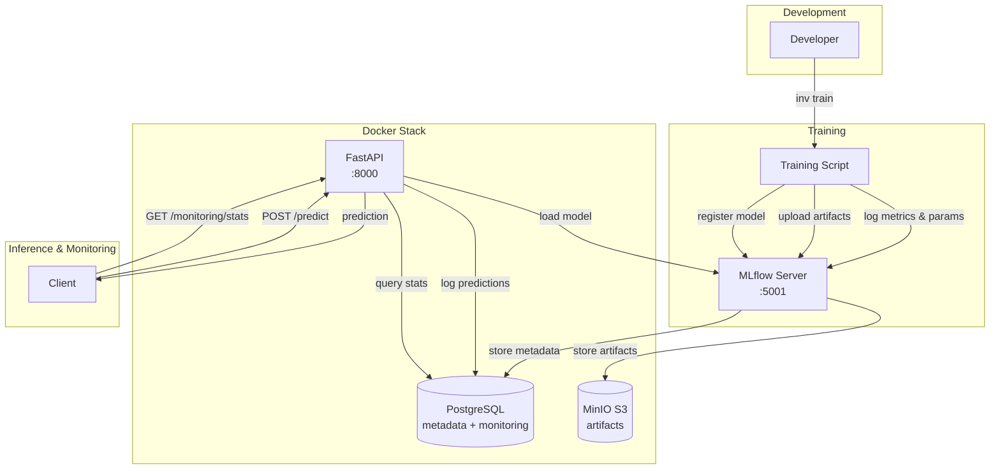
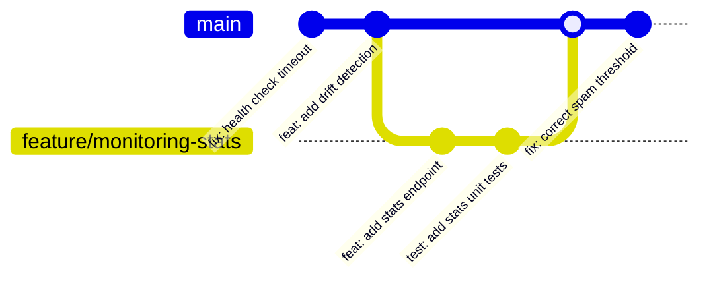
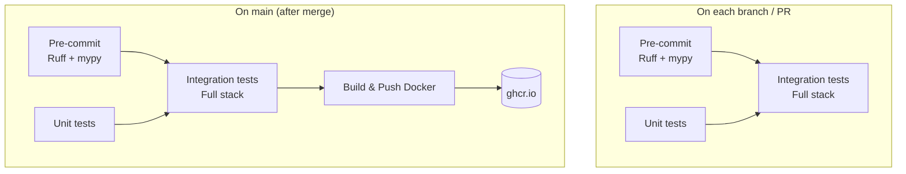
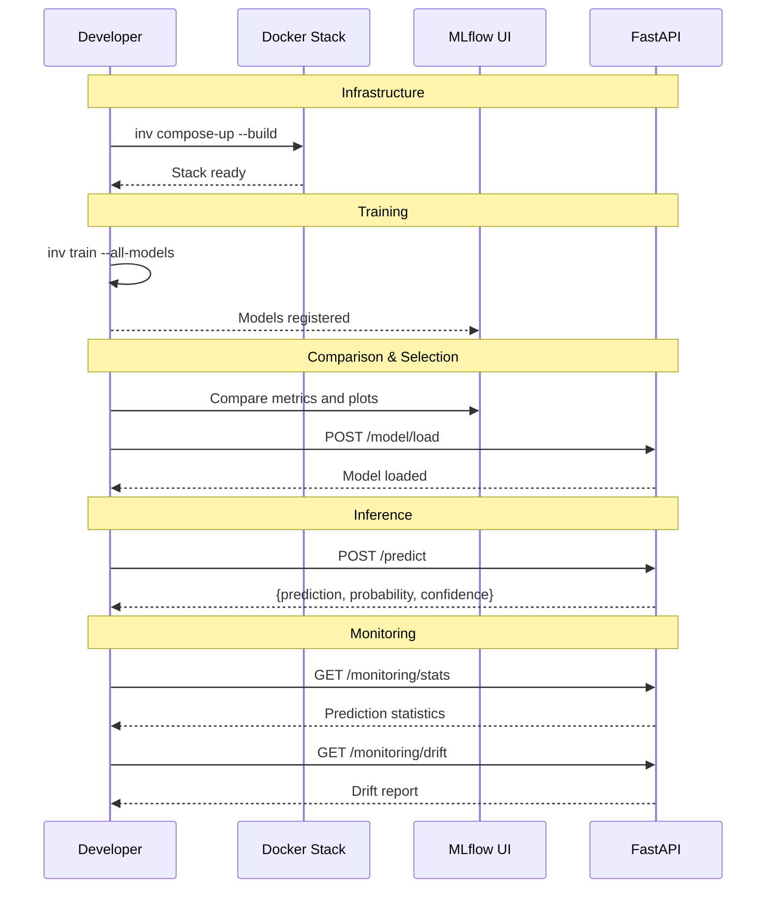

# Course MLOps - Spam Classifier

A complete MLOps pipeline built around a spam classifier: training, experiment tracking, API serving, monitoring, and Kubernetes deployment.

> **Disclaimer**: This repo is the final project of my MLOps course. The code and architecture here go well beyond what was expected from you. The goal is to give you a sense of what an MLOps project can look like at a larger scale and with more rigor. Treat it as a reference to explore, not as an expectation.

> The course materials have been sent to your university supervisor and should be available on the platform.

## Dataset

The dataset used for training (`data/spam.csv`) is the [SMS Spam Collection Dataset](https://www.kaggle.com/datasets/uciml/sms-spam-collection-dataset) from Kaggle. It contains 5,574 SMS messages labeled as spam or ham (legitimate).

## Questions

If you have questions about the code, architecture, or a concept, feel free to **open an issue**. I encourage you to prefer this approach over email:

- Future students will be able to find answers to the questions you're asking
- It helps me identify which parts of the course need to be deepened or better explained
- You practice a common habit in the industry: using issues to discuss a project
- The discussion stays public and accessible, instead of getting lost in a mailbox

## Tech Stack

> The tools listed below are just one possible combination. Don't blindly replicate this stack — always choose the technology that fits your specific problem, constraints, and team. This is an example, not a prescription.

| Category | Technologies |
|----------|-------------|
| API | [FastAPI](https://fastapi.tiangolo.com/), [Uvicorn](https://www.uvicorn.org/), [Pydantic](https://docs.pydantic.dev/) |
| ML | [scikit-learn](https://scikit-learn.org/), [XGBoost](https://xgboost.readthedocs.io/), [pandas](https://pandas.pydata.org/), [numpy](https://numpy.org/) |
| Tracking | [MLflow](https://mlflow.org/), [MinIO](https://min.io/) (S3) |
| Database | [PostgreSQL](https://www.postgresql.org/), [SQLAlchemy 2.0](https://www.sqlalchemy.org/), [Alembic](https://alembic.sqlalchemy.org/) |
| Monitoring | [Evidently](https://www.evidentlyai.com/) (drift detection), prediction logging |
| Infra | [Docker](https://www.docker.com/), [Docker Compose](https://docs.docker.com/compose/), [Kubernetes](https://kubernetes.io/) ([Helm](https://helm.sh/)), [CloudNativePG](https://cloudnative-pg.io/) |
| CI/CD | [GitHub Actions](https://github.com/features/actions) (pre-commit, tests, integration, Docker build + push GHCR) |
| Quality | [Ruff](https://docs.astral.sh/ruff/), [mypy](https://mypy-lang.org/), [pre-commit](https://pre-commit.com/), [commitizen](https://commitizen-tools.github.io/commitizen/), [pytest](https://docs.pytest.org/) |
| Tooling | [uv](https://docs.astral.sh/uv/), [Invoke](https://www.pyinvoke.org/), [Typer](https://typer.tiangolo.com/) |

## Architecture



## Project Structure

```
course_mlops/
├── api/                  # FastAPI: routes, schemas, service, model loader
├── train/                # Training pipeline
│   ├── models/           # Logistic Regression, XGBoost (factory pattern)
│   ├── preprocessing/    # Feature engineering (TF-IDF)
│   └── reporting/        # Evaluation, ROC curves, confusion matrices
├── monitoring/           # Prediction logging, drift detection (Evidently)
├── common/               # ORM base, transaction decorator
└── cli.py                # Typer CLI (train, serve, migrate)
tests/
├── unit/                 # Unit tests (API, training, monitoring)
└── integration/          # Integration tests (full stack)
chart/                    # Kubernetes Helm chart (API, MLflow, MinIO, PostgreSQL)
migrations/               # Alembic migrations
config/                   # YAML configuration
.github/workflows/        # GitHub Actions CI/CD
```

## Prerequisites

- Python 3.12
- Docker & Docker Compose
- [uv](https://docs.astral.sh/uv/)
- [Minikube](https://minikube.sigs.k8s.io/docs/) (for Kubernetes deployment)

## Quickstart

```bash
# 1. Install dependencies
uv sync

# 2. Activate the virtual environment
source .venv/bin/activate

# 3. Start the infrastructure (PostgreSQL, MLflow, MinIO, API + migrations)
inv compose-up --build

# 4. Train models
inv train --all-models

# 5. Test a prediction
curl -X POST http://localhost:8000/api/v1/predict \
  -H "Content-Type: application/json" \
  -d '{"message": "You won a free prize"}'

# 6. Check monitoring stats
curl http://localhost:8000/api/v1/monitoring/stats

# 7. Cleanup
inv compose-down
```

## Commands

Automation tasks use [Invoke](https://www.pyinvoke.org/) instead of a Makefile, to keep the project consistent in a single language: everything stays in Python.

To list all available commands: `inv -l`

```
Available tasks:

  compose-down
  compose-up
  integration-test   Start the stack, train a model, run integration tests,
                     then tear down.
  k8s-down           Uninstall the Helm release. Use --full to also stop
                     minikube.
  k8s-proxy          Open port-forwards to all UIs (API docs, MLflow, MinIO
                     console). Ctrl+C to stop.
  k8s-up             Start minikube, install CNPG operator, and deploy the Helm
                     chart.
  migrate            Apply database migrations (Alembic).
  test               Run unit tests with optional coverage.
  train
```

To see the options of a specific command: `inv <command> --help`

## API Endpoints

| Endpoint | Method | Description |
|----------|--------|-------------|
| `/` | GET | Service info |
| `/api/v1/health` | GET | Health check |
| `/api/v1/model/info` | GET | Loaded model info |
| `/api/v1/model/load` | POST | Load a specific model |
| `/api/v1/predict` | POST | Spam/ham prediction |
| `/api/v1/monitoring/stats` | GET | Prediction statistics |
| `/api/v1/monitoring/drift` | GET | Drift detection |
| `/api/v1/config` | GET | Model configuration |

### Example

```bash
curl -X POST http://localhost:8000/api/v1/predict \
  -H "Content-Type: application/json" \
  -d '{"message": "CONGRATULATIONS You won a FREE iPhone Click here NOW"}'
```

```json
{
  "message": "CONGRATULATIONS You won a FREE iPhone Click here NOW",
  "prediction": "spam",
  "probability": 0.74,
  "confidence": "medium"
}
```

## Services

| Service | URL | Description |
|---------|-----|-------------|
| API | http://localhost:8000 | FastAPI (docs: `/docs`) |
| MLflow | http://localhost:5001 | Tracking UI |
| MinIO | http://localhost:9001 | S3 Console |

## Workflows

### CI/CD

In practice, the development workflow follows this cycle:

1. Create a branch from `main`
2. Develop and commit on that branch
3. Open a Pull Request to `main`
4. The CI pipeline triggers automatically and validates the code
5. Once the PR is approved and merged, the Docker image is published

The benefit of this approach: `main` always stays in a clean and valid state. At any point, you can release a new version from `main` with confidence, since every commit that lands there has already been tested and approved.



When a PR is merged into `main`, commitizen automatically prepares a release PR (titled `bump: version X.Y.Z`) with the version bump and changelog update. Once this release PR is merged, the CI builds and pushes the Docker image to GHCR.

This convention opens the door to **GitOps**: a tool like [ArgoCD](https://argo-cd.readthedocs.io/) or [Fleet](https://fleet.rancher.io/) can watch the repository for commits matching a specific pattern (e.g. `bump: version *` on `main`) and automatically deploy the new version to the production cluster — closing the loop between release and deployment without any manual intervention.

On each branch (PR), validation steps run to ensure code quality and reliability before merging. On `main`, these same steps run again, followed by the Docker image publication:



### User Workflow



### Kubernetes Deployment

```bash
inv k8s-up      # Deploy
inv k8s-proxy   # Port-forward to services
inv k8s-down    # Tear down
```

## Database

The project uses **[SQLAlchemy 2.0+](https://www.sqlalchemy.org/)** with **[Alembic](https://alembic.sqlalchemy.org/)** for migrations.

Why SQLAlchemy instead of raw SQL queries? An ORM lets you interact with the database in Python, using objects and methods instead of SQL strings. You gain readability, maintainability, and avoid classic mistakes (SQL injection, typos in column names). It also stays consistent with the rest of the project: everything is in Python.

Why Alembic? In production, you can't just `DROP TABLE` and recreate the schema on every deployment -- you'd lose the data. Alembic lets you version schema changes (adding a column, changing a type, etc.) and apply them incrementally, just like Git versions code. Each migration is a reproducible script, which guarantees that all environments (dev, staging, prod) have the same schema.

Migrations are applied automatically when the stack starts.

## Going Further

Due to time constraints, several MLOps practices were not covered in this course. Here is a non-exhaustive list of topics worth exploring to deepen your understanding of production ML systems:

- **Feature Store** — A centralized repository for storing, versioning, and serving ML features consistently across training and inference. It avoids duplicating feature logic and ensures that the model sees the same features in production as during training.
  - [What is a Feature Store? (Databricks)](https://www.databricks.com/glossary/what-is-a-feature-store)
  - [Feature Store For ML (featurestore.org)](https://www.featurestore.org/)

- **Automated Retraining** — Instead of manually retraining models, an automated pipeline can trigger retraining on a schedule or in response to detected data drift. This keeps the model up to date as the data distribution evolves over time.
  - [MLOps: Continuous Delivery and Automation Pipelines (Google Cloud)](https://docs.cloud.google.com/architecture/mlops-continuous-delivery-and-automation-pipelines-in-machine-learning)
  - [Automatic Model Retraining: When and How to Do It?](https://enhancedmlops.com/automatic-model-retraining-when-and-how-to-do-it/)

- **Data Versioning** — Just like code is versioned with Git, datasets should be versioned to ensure reproducibility. Tools like DVC (Data Version Control) track dataset changes alongside code, so you can always trace which data was used to train a given model.
  - [Get Started with DVC](https://dvc.org/doc/start/data-management/data-versioning)
  - [Intro to MLOps: Data and Model Versioning (W&B)](https://wandb.ai/site/articles/intro-to-mlops-data-and-model-versioning/)

- **A/B Testing & Canary Deployments** — Before fully replacing a model in production, you can serve both the old and new model simultaneously and compare their performance on real traffic. This reduces the risk of deploying a model that performs worse in practice.
  - [ML Deployment Strategies (AWS Well-Architected)](https://docs.aws.amazon.com/wellarchitected/latest/machine-learning-lens/deployment.html)

- **Alerting & Observability** — Exporting application metrics (latency, error rates, prediction distributions) to systems like Prometheus and Grafana, and setting up alerts when drift is detected or performance degrades.
  - [A Simple Solution for Monitoring ML Systems (Jeremy Jordan)](https://www.jeremyjordan.me/ml-monitoring/)
  - [Grafana Tutorial: Monitoring ML Models (DataCamp)](https://www.datacamp.com/tutorial/grafana-tutorial-monitoring-machine-learning-models)
